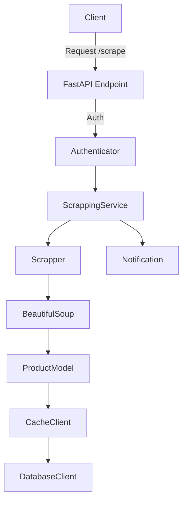

# Dental Product Scraper with FastAPI and BeautifulSoup


This project is a web scraping tool that extracts product information such as product name, price, and image from the Dental Stall website. It uses Python's FastAPI framework, BeautifulSoup for scraping, and follows a modular and object-oriented approach to ensure scalability and maintainability.


## Table of Contents


1. [Project Overview](#project-overview)

2. [Features](#features)

3. [Project Architecture](#project-architecture)

4. [Libraries and Tools Used](#libraries-and-tools-used)

5. [Setup and Installation](#setup-and-installation)

6. [Running the Project](#running-the-project)

7. [Pre-commit Hooks, Flake8, Black, and Isort](#pre-commit-hooks-flake8-black-and-isort)

8. [Project Flow](#project-flow)

9. [Mermaid Diagram](#mermaid-diagram)

10. [Future Improvements](#future-improvements)


## Project Overview


This tool automates the process of scraping product data from [Dental Stall](https://dentalstall.com/shop/). It extracts product names, prices, and images and stores the data in a local JSON file. The application also includes features like proxy support, retry mechanism, result caching, and notification upon completion of the scraping task.


## Features


-  **Scraping**: Scrapes product names, prices, and images from the Dental Stall catalogue.

-  **Pagination**: Supports scraping from multiple pages with a limit on the number of pages to scrape.

-  **Retry Mechanism**: Retries scraping in case of errors or server issues.

-  **Proxy Support**: Can use proxies to scrape the website.

-  **Caching**: Implements a caching mechanism to avoid updating unchanged data.

-  **Notifications**: Notifies how many products were scraped and updated after each session.

-  **Authentication**: Static token authentication for the scraping endpoint.


## Project Architecture
```bash
├── app
│   ├── auth
│   │   └── auth.py          # Contains authentication logic
│   ├── config.py            # Configuration file (e.g., BASE_URL, TOKEN)
│   ├── models
│   │   └── pydantic
│   │       └── product.py    # Pydantic model for Product
│   ├── services
│   │   ├── cache.py          # Caching service
│   │   ├── database.py       # Database service (stores data in JSON)
│   │   ├── notification.py   # Notification service
│   │   ├── scrapper.py       # Scraper logic with retry mechanism
│   │   └── scraping_service.py  # Scraping service to orchestrate data scraping and storing
├── main.py                   # FastAPI app entry point
├── .flake8                   # Flake8 configuration file
├── pre-commit-config.yaml     # Pre-commit hooks configuration
└── setup_hooks.sh            # Setup script for installing pre-commit hooks
├── config.yaml               # Config file which stores token and target scraping website.

```


## Libraries and Tools Used

- **[FastAPI](https://fastapi.tiangolo.com/)**: Web framework for building APIs with Python.
- **[BeautifulSoup](https://www.crummy.com/software/BeautifulSoup/)**: Library for parsing HTML and extracting data.
- **[Requests](https://docs.python-requests.org/)**: Library for making HTTP requests.
- **[Pydantic](https://pydantic-docs.helpmanual.io/)**: Data validation and settings management.
- **[Pre-commit](https://pre-commit.com/)**: Framework for managing and maintaining multi-language pre-commit hooks.
- **[Flake8](https://flake8.pycqa.org/en/latest/)**: Python linter for style guide enforcement.
- **[Black](https://black.readthedocs.io/en/stable/)**: Python code formatter.
- **[isort](https://pycqa.github.io/isort/)**: Sorts Python imports.

## Setup and Installation

### 1. Clone the Repository
    git clone https://github.com/yourusername/dental-product-scraper.git
    cd dental-product-scraper

### 2. Setup Python Virtual Environment
    python3 -m venv venv
    source venv/bin/activate  # Linux/Mac
    venv\Scripts\activate  # Windows

### 3. Install Dependencies
    pip install -r requirements.txt

### 4. Setup Pre-commit Hooks
The project uses pre-commit hooks for automating linting and formatting checks before every commit.

#### Pre-commit Configuration

The `.pre-commit-config.yaml` file in this project contains the following hooks:

-   **Trailing Whitespace**: Ensures no trailing whitespace is left.
-   **End-of-file Fixer**: Ensures files end with a newline.
-   **Check YAML**: Validates `.yaml` files.
-   **Flake8**: Lints Python code for PEP8 compliance.
-   **isort**: Sorts imports in a consistent manner with `black`.
-   **Black**: Formats Python code to ensure consistency.

#### Install and Run Pre-commit Hooks

Run the `setup_hooks.sh` script to install and configure the pre-commit hooks:

    bash setup_hooks.sh

Alternatively, run the following commands:

    pip install pre-commit
    pre-commit install

You can check your files for compliance using:
    pre-commit run --all-files

### 5. Configure Flake8

`Flake8` is used for linting, and the configuration is in `.flake8`:

```bash
[flake8]
max-line-length = 200
ignore = E203, W503
```

-   **max-line-length**: Set to 200 characters to allow more flexibility in long lines.
-   **ignore**: Ignores specific PEP8 warnings that are in conflict with `black`.

To run `flake8` manually:

    flake8 .

### 6. Add a config.yaml file in the root directory
```bash
token: "static_token"
base_url: "https://dentalstall.com/shop"
```
**Please note that project won't run without this file present as it's designed to use the config for authentication and scrapping process.**

## Running the Project

    uvicorn app.main:app --reload

The FastAPI server will be running at [http://127.0.0.1:8000/](http://127.0.0.1:8000/)

You can access the scraping endpoint at [http://127.0.0.1:8000/scrape](http://127.0.0.1:8000/scrape)

## Pre-commit Hooks, Flake8, Black, and Isort

### Why We Use Them:

-   **Pre-commit Hooks**: Automate checking for code quality, style, and formatting issues before committing.
-   **Flake8**: Ensures PEP8 compliance and overall code quality.
-   **Black**: Provides consistent code formatting across the project.
-   **Isort**: Automatically sorts imports to maintain a clean and organized codebase.

### How to Use:

-   The pre-commit hooks will automatically run before you commit your changes.
-   If you want to check all files, run:

        pre-commit run --all-files

This ensures your code meets all style and quality guidelines before pushing it to the repository.

## Project Flow

The project follows a modular and object-oriented approach. Here's a simplified flow:

1.  **Client** sends a GET request to `/scrape`.
2.  The **Authenticator** validates the request using a static token.
3.  **ScrappingService** is invoked to scrape the product data from the given number of pages.
4.  The **Scrapper** class makes HTTP requests to the target website and parses the HTML using **BeautifulSoup**.
5.  The product data (name, price, and image) is cached and stored in the database (local JSON file).
6.  A **Notification** is sent to the console after the process completes, reporting how many products were scraped and updated.

### Sample Curl
```bash
curl --location 'http://localhost:8000/scrape?limit=10&max_retries=1&retry_delay=2&return_all_scraped_data=True&return_current_scraped_data=False' \
--header 'Authorization: Bearer static_token'
```

## Mermaid Diagram



## Future Improvements

-   **Async scraping**: Implement asynchronous requests to speed up the scraping process using RabbitMQ, Celery, etc.
-   **Notifications**: Expand the notification system to send emails or messages via other communication channels.
-   **Scalable storage**: Replace the JSON-based database with a scalable solution such as PostgreSQL or MongoDB.
-   **Improved error handling**: Handle more edge cases, such as network failures, and log them.

## Notes:
Please add a config.
